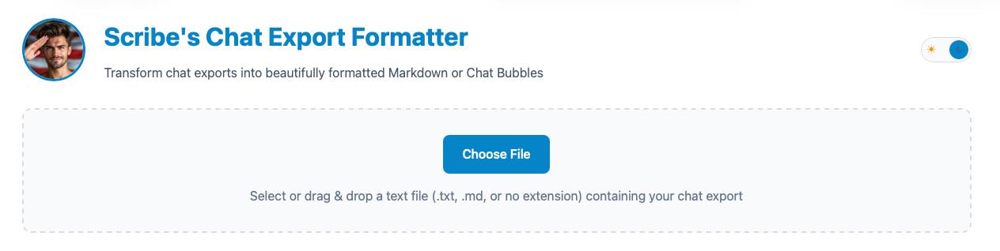

# Scribe's Chat Export Formatter
>Transform chat exports into beautifully formatted Markdown or Chat Bubbles

---

## TL;DR
- Developed and merged into a single-file format web app that can be run in a local web browser
- No accounts or logins required
- No data sent or stored anywhere
- No server-side processing required
- No need to install any software

## Why?
Have you ever had a conversation with an AI character that was so amazing that you wanted to keep it? Or, had a conversation
whose dialog you wanted to use in a story? Or wanted a clear and easily understandable way to present conversational data
for testing or debugging? 

Only keeping your conversations on the server can risk losing them, and exporting them usually results in pretty bland text 
files whose format is terse and not necessarily easy to read. I wanted a simple way to convert
my chat exports, an aesthetically pleasing way to view my saved/exported convos, and I wanted to be able to save them 
in a single file format that I could share.

## What it does
Uses the [Chat Export Parser](https://github.com/droidengineer/chat-export-formatter) to parse chat exports into a Markdown 
or Chat Bubbles format, allowing you to save in .md and .html formats, respectively, and providing a simple and prettier 
way to view chat logs.

## Demo
https://droidengineer.github.io/chat-export-formatter/

## License
MIT License